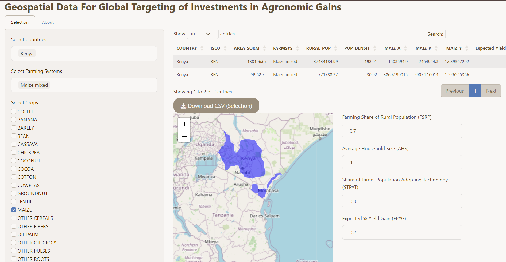
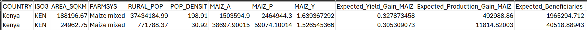
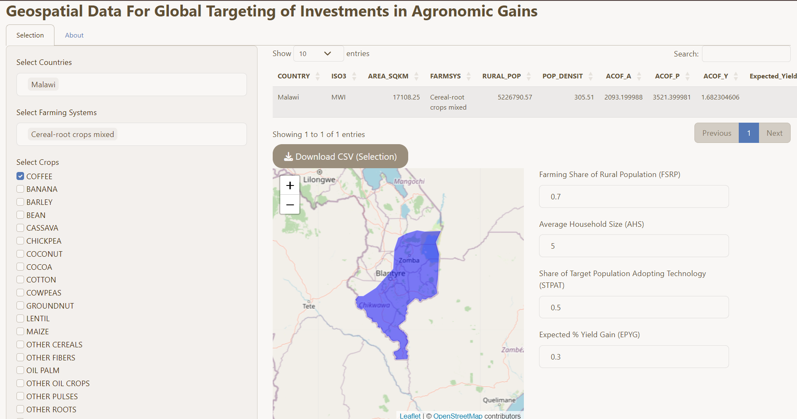
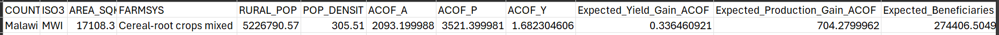

# Introduction

The <a href="https://cimmyt-apps.shinyapps.io/Agronomics_geospatial_data/">Agronomic Ex Ante Explorer</a> is a tool designed to enable users to develop a reasonable starting point for structured ex ante estimates of potential beneficiaries and benefits to a prospective agronomy investment, in cases where limited data resources are available for more comprehensive and rigorous ex ante evaluations. It is not intended to obviate more rigorous analysis, where data enable such work. However, it may be a useful tool for assembling some initial estimates of the potential number of beneficiaries of an agronomy project focused on a particular crop and geography, as well as offering a structured way to make underlying assumptions (e.g., on adoption rates, yield gains to adoption) explicit. 

This guide is intended to walk users through an example of how such a tool may be used. It makes reference to this web-based tool. The tool was developed as part of the ex ante analytical resources assembled under the Excellence in Agronomy (EiA) initiative of the One CGIAR. 

The app is global in scope and allows users to select two nested levels of geography: (i) country, and (ii) farming system, as well as information about the target crops and the current level of agronomic practices. The app offers an intuitive interface that allows you to summarize a range of spatially-explicit agricultural data, including production and yield estimates for specific crops in different areas. The goal of the tool is to provide initial insights into the potential impact of investments in different farming systems and countries, based on existing geospatial data resources and user-defined assumptions, when more detailed data on adoption and impacts are not readily available.

# The User Interface

The app is divided into two main tabs: "Selection" and "About."

## "Selection" tab

In the "Selection" tab, users make selections of countries, farming systems, and crops of interest. The main features include:

- Data Table: Displays filtered data based on user selections.

- Download Button: Allows users to download the filtered data as a CSV file.

- Map: Visualizes selected countries and farming systems on a leaflet map.

- Numeric Inputs: Control parameters for calculations, such as Farming Share of Rural Population, Average Household Size, Technology Adoption Rate, and Expected % Yield Gain.

The Numeric inputs are the assumptions that you will have to make before using the Ex-ante summary tool. Here is a brief description of the assumptions. 

- Farming Share of Rural Population (FSRP): This is the percentage of the rural population engaged in farming. For example, if you assume that 70% of the rural population is engaged in farming, FSRP would be 0.70.

- Average Household Size (AHS): This is the average number of people in a household. For example, if you assume an average household size of 5, AHS would be 5.

- Share of Target Population Adopting the Technology (STPAT): This is the percentage of the target population that adopts the technology or practices promoted by the investment. For example, if you assume that 50% of the target population adopts the technology, STPAT would be 0.50.

- Expected Percentage Yield Gain (EPYG): This is the expected percentage increase in yield due to the investment. For example, if you expect a 20% increase in yield, EPYG would be 0.20.

## "About" tab

The "About" tab provides information about the app, its purpose, and the sources of data. Key elements include:

- About this App: Describes the purpose of the decision support tool.

- Variable Descriptions: Displays a table describing various variables used in the app.

- Data Sources: Lists the sources of geospatial data.

# Examples

## Example use case 1: maize in Kenya

In this example, we develop a structured estimate the potential returns to an agronomy investment targeting Kenyan maize farmers. We use the tool to derive initial estimates of outcomes of interest (number of beneficiaries, average yield gains, and expected production increases) based on geospatial data on production and rural populations, as well as user-defined estimates of the farming share of the local population, number of adopters and expected average yield gains to adopters of the technology.  

### 1. Select Geography and Crop

  - [Open the Agronomic Ex Ante Explorer](https://cimmyt-apps.shinyapps.io/Agronomics_geospatial_data/)
  
- In the "Selection" tab, choose Kenya as the country and maize mixed as the farming system.
- Select maize as the crops you want to analyze.

    *Figure 1: Case Study 1 Selection*
    
  
### 2. Download File    

- Click the "Download CSV (Selection)" button to obtain the filtered data.

       *Figure 2: Downloaded Filtered Data*
       
### 3. Calculating Ex Ante Outcome Estimates

Given the data and assumptions from the application:

Assumptions:

- FSRP: 70%

- AHS: 4

- STPAT: 30% 

- EPYG: 20%

downloaded data above:

- Physical area of maize (MAIZ_A) = 1503594.9 hectares

- Production of maize (MAIZ_P) = 2464944.3 MT

- Yield of maize (MAIZ_Y) = 1.64 MT/ha (calculated as MAIZ_P / MAIZ_A)
    
#### Calculations:

(a). **Expected Number of Investment Beneficiaries**

Expected Number of Beneficiaries = (RURAL_POP * FSRP) / AHS * STPAT

Expected Number of Beneficiaries = (37434184.99 * 0.70) / 4 * 0.30 ≈ 1965294.71

≈ 1965294.71

(b). **Expected Average Yield Gain**

Expected Average Yield Gain = MAIZ_Y * EPYG

Expected Average Yield Gain = 1.64 MT/ha * 0.20 = 0.33 MT/ha

≈ 0.33 MT/ha

(c). ***Expected Production Gain***

Expected Production Gain = MAIZ_P * EPYG

Expected Production Gain = 2464944.3 MT * 0.20 ≈ 492988.86 MT

≈ 492,988.86 MT

## Example use case 2: coffee in Malawi

In this example, we follow a similar logic to develop an initial estimate of the returns to a coffee agronomy investment in Malawi. We use the tool to derive an initial estimate of the total number of project beneficiaries, average yield gains, and expected production increases that may accrue to the investment, based on user-defined estimates of the farming share of the local population, number of adopters and expected average yield gains to adopters of the technology.  

### 1. Select Geography and Crop

- In the "Selection" tab, choose Malawi as the country and Cereal-root crops mixed as the farming systems you're interested in.

- Select Coffee as the crops you want to analyze.

*Figure 3: Case Study 2 Selection*

### 2. Download File 

*Figure 4: Downloaded Filtered Data*

### 3. Calculate Ex Ante Outcome Estimates

Given the data and assumptions:

Assumptions:

- FSRP: 70%

- AHS: 5

- STPAT: 50%

- EPYG: 30%

Downloaded data above:

- Physical area of coffee (ACOF_A) = 2093.199988 hectares

- Production of coffee (ACOF_P) = 3521.399981 MT

- Yield of coffee (ACOF_Y) = 1.682304606 MT/ha

#### Calculations:

(a). **Expected Number of Investment Beneficiaries**

Expected Number of Beneficiaries=(RURAL_POP×FSRP)/AHS×STPAT

Expected Number of Beneficiaries = (5226790.57×0.70)/5×0.50 ≈365875.3399

 ≈ 365875.34

(b). **Expected Average Yield Gain**

Expected Average Yield Gain = ACOF_Y×EPYG

Expected Average Yield Gain = 1.682304606 MT/ha × 0.30 ≈0.50 MT/ha

 ≈ 0.50 MT/ha

(c). **Expected Production Gain**

Expected Production Gain = ACOF_P×EPYG

Expected Production Gain = 3521.399981 MT × 0.30 ≈ 1056.4199943 MT

 ≈ 1056.42 MT
 
 
# Data Sources

The tool utilizes data from various sources, including:

- <a href="https://gadm.org/data.html">GADM</a>,

- <a href="https://data.apps.fao.org/map/catalog/static/api/records/4e463d70-7593-11db-b9b2-000d939bc5d8">FAO</a>, 

- <a href="https://hub.worldpop.org/project/categories?id=3">WorldPop</a>, and

- <a href="https://data.apps.fao.org/catalog/iso/59f7a5ef-2be4-43ee-9600-a6a9e9ff562a">SPAM</a>.

 
# Acknowledgments

This work was supported by <a href="https://www.cimmyt.org/">CIMMYT</a>. It was developed as part of <a href="https://www.cgiar.org/initiative/excellence-in-agronomy/">Excellence in Agronomy (EiA) </a>, one of the initiatives of <a href="https://www.cgiar.org/food-security-impact/one-cgiar/">One CGIAR</a>.

<footer style="text-align:center; margin-top: 50px;">
  
  
  
</footer>

    
